# HydroDeepNet: AI-Powered Hydrological Insights Platform

HydroDeepNet is an AI-powered online platform that integrates hydrological modeling, deep learning, and multi-agent AI systems to provide comprehensive hydrological insights at local, state, and national scales.

## Key Developments

The platform currently consists of four significant developments:

### 1. Automated Hydrological Model Generation

HydroDeepNet streamlines the generation, calibration, and validation of surface water (SWAT+) and groundwater (MODFLOW) models at high resolution with exceptional flexibility. It enables rapid model creation for any location across the conterminous United States (CONUS), significantly reducing the traditionally time-consuming process that requires extensive data collection and technical expertise.

Unlike other platforms such as the National Agroecosystem Model (NAM), which relies on NHDPlus V2 (1:100k resolution), HydroDeepNet leverages NHDPlus HR (1:24k resolution), providing 20 times greater detail. This results in more precise watershed delineation and hydrological modeling, significantly improving water balance estimation and contaminant fate predictions.

The system has been tested with 700 models across the US using USGS Federally Prioritized Streamgage (FPS) data, successfully creating 660 models while 40 failed due to hydrographical complexities. Additionally, 60 calibrated and validated models were established for USGS watersheds across Michigan, demonstrating high predictive accuracy.

The following flowchart shows the different parts of the hydrological model generation, integration, and calibration.

```mermaid
%%{init: {'theme': 'default', 'flowchart': {'curve': 'natural', 'diagramPadding': 20}, 'themeVariables': {'fontSize': '16px', 'fontFamily': 'arial'}}}%%
graph LR
    title["<b>HydroDeepNet System Architecture</b><br><i>Hydrological Modeling with AI and Multi-Agent Retrieval</i>"]:::title

    %% 1. INPUT DATASETS
    subgraph Input_Datasets["Input Datasets"]
    direction TB
        PRISM("PRISM"):::datasource
        LOCA2("LOCA2"):::datasource
        MODIS("MODIS"):::datasource
        NLCD("NLCD"):::datasource
        NSRSDB("NSRSDB"):::datasource
        gSSURGO("gSSURGO"):::datasource
        USGSDEM("USGS DEM"):::datasource
        SNODAS("SNODAS"):::datasource
        CDL("CDL"):::datasource
    end

    %% 2. DATA INTEGRATION
    HydroGeoProcessor{{"HydroGeoProcessor<br>(Data Integration)"}}:::developed
    hydroGeoDatasetCyl["HydroGeoDataset"]:::storage

    %% Additional Data Inputs
    NWIS("NWIS"):::existing
    NHDPlusHR("NHDPlus HR"):::datasource

    %% 3. HYDROLOGICAL MODELING
    subgraph Hydrological_Modeling["Hydrological Modeling"]
    direction TB
        SWATGenX{{SWATGenX}}:::developed
        QSWATPlus("QSWAT+"):::existing
        SWATPlusEditor("SWAT+ Editor"):::existing
        SWATPlus("SWAT+"):::models
        SWATPlusGwflow("SWAT+gwflow"):::models
    end

    %% GROUNDWATER MODELING
    subgraph Groundwater_Modeling["Groundwater Modeling"]
    direction TB
        WellInfo("Water Well Info<br>(Wellogic)"):::datasource
        EBK("Empirical Bayesian Kriging"):::existing
        HydraulicProps("Hydraulic Properties"):::process
        MODGenX{{MODGenX}}:::developed
        Flopy("Flopy"):::existing
        MODFLOWNWT("MODFLOW-NWT"):::models
    end

    %% 4. PARALLEL PROCESSING
    subgraph Parallel_Processing["Parallel Processing"]
    direction TB
        PPS["PPS Controller"]:::existing
        Validation("Validation<br>(Ensemble)"):::developed
        Calibration("Calibration<br>(PSO)"):::developed
        Sensitivity("Sensitivity<br>(Morris)"):::developed
        hydroGeoHDFCyl["HydroGeoDataset (HDF5)"]:::storage
    end

    %% 5. AI & REPORTING
    subgraph AI_Reporting["AI & Reporting"]
    direction TB
        VisionSystem("Vision System<br>(Deep Learning, PyTorch)"):::developed
        MultiAI["Multi-AI Agents<br>(RAG System)"]:::llm
        Reports["Reports & Visualization"]:::document
    end

    %% ---- EDGES / CONNECTIONS ----

    %% (A) Input to Data Processor
    Input_Datasets --> HydroGeoProcessor
    HydroGeoProcessor --> hydroGeoDatasetCyl

    %% (B) Data to SWATGenX
    Input_Datasets --> SWATGenX
    NWIS --> SWATGenX
    NHDPlusHR --> SWATGenX

    %% (C) Hydrological Modeling Flow
    SWATGenX --> QSWATPlus
    QSWATPlus --> SWATPlusEditor
    SWATPlusEditor --> SWATPlus
    SWATPlus --> SWATPlusGwflow

    %% (D) Groundwater Modeling Flow
    WellInfo --> EBK
    EBK --> HydraulicProps
    HydraulicProps --> MODGenX
    MODGenX --> Flopy
    Flopy --> MODFLOWNWT

    %% (E) Parallel Processing Flow
    SWATPlusGwflow --> PPS
    MODFLOWNWT --> PPS
    PPS --> Validation
    PPS --> Calibration
    PPS --> Sensitivity
    Validation --> hydroGeoHDFCyl
    Calibration --> hydroGeoHDFCyl
    Sensitivity --> hydroGeoHDFCyl

    %% (F) AI & Reporting Flow
    hydroGeoDatasetCyl --> VisionSystem
    VisionSystem --> MultiAI
    hydroGeoHDFCyl --> MultiAI
    HydroGeoProcessor --> MultiAI
    MultiAI --> Reports

    %% STYLING
    classDef title font-size:20px,fill:none,stroke:none,font-weight:bold,text-align:center
    classDef developed fill:#e1d5e7,stroke:#000000,stroke-width:2px,rx:5,ry:5,font-weight:bold
    classDef existing fill:#cce5ff,stroke:#36393d,stroke-width:1px,rx:5,ry:5
    classDef models fill:#cdeb8b,stroke:#36393d,stroke-width:1px,rx:5,ry:5
    classDef datasource fill:#f0a30a,stroke:#BD7000,stroke-width:1px,rx:4,ry:4,color:#000000,font-weight:bold
    classDef process fill:#f5f5f5,stroke:#000000,stroke-width:1px,rx:6,ry:6
    classDef storage fill:#e51400,stroke:#000000,stroke-width:1px,rx:10,ry:10,color:#000000,font-weight:bold
    classDef llm fill:#1ba1e2,stroke:#006EAF,stroke-width:1px,rx:8,ry:8,color:white
    classDef document fill:#ffff88,stroke:#36393d,stroke-width:1px
```

### 2. 4D Spatiotemporal Deep Learning Vision System

HydroDeepNet includes a hybrid CNN-Transformer deep learning model with 130 million parameters to predict evapotranspiration and groundwater recharge in 4D (time and 3D space). The results have been submitted to the Engineering Applications of Artificial Intelligence journal.

Traditional modeling, such as SWAT+ and MODFLOW, remains resource-intensive. While HydroDeepNet simplifies model creation, deep learning models provide a faster alternative for hydrological predictions with comparable accuracy.

Deep learning enhances model predictions, improves data accuracy in missing-value scenarios, and supports decision-making for drought monitoring, flood forecasting, and groundwater management.

### 3. Automated Environmental and Agricultural Reporting System

HydroDeepNet compiles and structures large datasets, generating automated reports on environmental indicators, including climate conditions, crop composition, solar energy balance, climate change projections, soil properties, and groundwater hydraulic conditions.

Reports are generated in a structured format with markdown-based evaluations, allowing rapid assessments of agricultural and environmental conditions. The system is currently operational for Michigan and will be expanded to CONUS.

### 4. Multi-AI Agent System for Hydrological Insights

A multi-agent AI system reads reports and model outputs, providing users with evidence-based agricultural and environmental insights.

While the current AI agent implementation is limited, it will be fully operational upon the official launch of the web application.

## Software and Libraries

HydroDeepNet incorporates elements from various open-source software and libraries, including:

*   QGIS, QSWAT+, and SWATPlusEditor are used to create SWAT+ models. Example: [QGSWAT+ GitHub Repository](https://github.com/swat-model/QSWATPlus)
*   GDAL library for the analyses and processing of geospatial data.
*   Flopy library for creating MODFLOW models.
*   PyTorch library for creating and training hydrological deep learning models.
*   Ollama library for the Multi-AI agents of the platform.
*   React for serving frontend
*   Docker and Kubernetes for deploying the platform