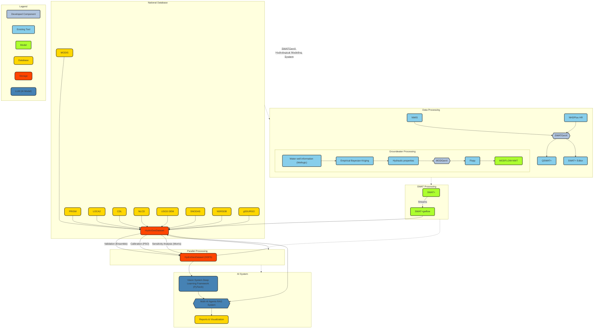

```mermaid
%%{init: {'theme': 'default', 'flowchart': {'curve': 'basis'}}}%%
graph TB
    %% Title and overall styling
    title[<u>SWATGenX Hydrological Modeling System</u>]
    title:::title

    subgraph National_Database["National Database"]
        direction LR
        MODIS["MODIS"]:::database --> HydroGeoDataset
        PRISM["PRISM"]:::database --> HydroGeoDataset
        LOCA2["LOCA2"]:::database --> HydroGeoDataset
        CDL["CDL"]:::database --> HydroGeoDataset
        NLCD["NLCD"]:::database --> HydroGeoDataset
        USGSDEM["USGS DEM"]:::database --> HydroGeoDataset
        SNODAS["SNODAS"]:::database --> HydroGeoDataset
        NSRSDB["NSRSDB"]:::database --> HydroGeoDataset
        gSSURGO["gSSURGO"]:::database --> HydroGeoDataset
    end

    subgraph Data_Processing["Data Processing"]
        direction TB
        NWIS["NWIS"]:::existing --> SWATGenX{{SWATGenX}}:::developed
        NHDPlusHR["NHDPlus HR"]:::existing --> SWATGenX
        SWATGenX --> QSWATPlus["QSWAT+"]:::existing
        SWATGenX --> SWATPlusEditor["SWAT+ Editor"]:::existing

        subgraph Groundwater_Processing["Groundwater Processing"]
            direction LR
            WellInfo["Water well information (Wellogic)"]:::existing --> EBK["Empirical Bayesian Kriging"]:::existing
            EBK --> HydraulicProps["Hydraulic properties"]:::existing
            HydraulicProps --> MODGenX{{MODGenX}}:::developed
            MODGenX --> Flopy["Flopy"]:::existing
            Flopy --> MODFLOWNWT["MODFLOW-NWT"]:::models
        end
    end

    subgraph SWAT_Processing["SWAT Processing"]
        SWATPlus["SWAT+"]:::models -->|Streams| SWATPlusGwflow["SWAT+gwflow"]:::models
        SWATPlusGwflow --> HydroGeoDataset
    end

    subgraph Parallel_Processing["Parallel Processing"]
        direction TB
        HydroGeoDataset -- "Validation (Ensemble)" --> HydroGeoDataset_HDF5["HydroGeoDataset (HDF5)"]:::storage
        HydroGeoDataset -- "Calibration (PSO)" --> HydroGeoDataset_HDF5
        HydroGeoDataset -- "Sensitivity Analysis (Morris)" --> HydroGeoDataset_HDF5
    end

    subgraph AI_System["AI System"]
        direction TB
        HydroGeoDataset_HDF5 --> VisionSystem["Vision System Deep Learning Framework (PyTorch)"]:::llm
        HydroGeoDataset_HDF5 --> HydroGeoDataset
        VisionSystem --> MultiAI{{Multi-AI Agents RAG System}}:::llm
        HydroGeoDataset --> MultiAI
        MultiAI --> Reports["Reports & Visualization"]:::database
    end

    %% Connections between subgraphs
    National_Database -.-> Data_Processing
    Data_Processing -.-> SWAT_Processing
    SWAT_Processing -.-> Parallel_Processing
    Parallel_Processing -.-> AI_System

    %% Legend
    subgraph Legend["Legend"]
        direction LR
        dev["Developed Component"]:::developed
        ex["Existing Tool"]:::existing
        mod["Model"]:::models
        db["Database"]:::database
        sto["Storage"]:::storage
        llm["LLM (AI Model)"]:::llm
    end

    %% Class Definitions with enhanced styling
    classDef developed fill:#B0C4DE,stroke:#000,stroke-width:2px,rx:5,ry:5
    classDef existing fill:#87CEEB,stroke:#000,stroke-width:2px,rx:5,ry:5
    classDef models fill:#ADFF2F,stroke:#000,stroke-width:2px,rx:5,ry:5
    classDef database fill:#FFD700,stroke:#000,stroke-width:2px,rx:10,ry:10
    classDef storage fill:#FF4500,stroke:#000,stroke-width:2px,rx:10,ry:10
    classDef llm fill:#4682B4,stroke:#000,stroke-width:2px,rx:10,ry:10
    classDef title font-size:18px,fill:none,stroke:none

    %% Apply classes to nodes
    HydroGeoDataset_HDF5:::storage
    HydroGeoDataset:::storage
    SWATPlusGwflow:::models
    SWATPlus:::models
    MODFLOWNWT:::models
    QSWATPlus:::existing
    SWATPlusEditor:::existing
    SWATGenX:::developed
    MODGenX:::developed
    MultiAI:::llm
    Reports:::database
```