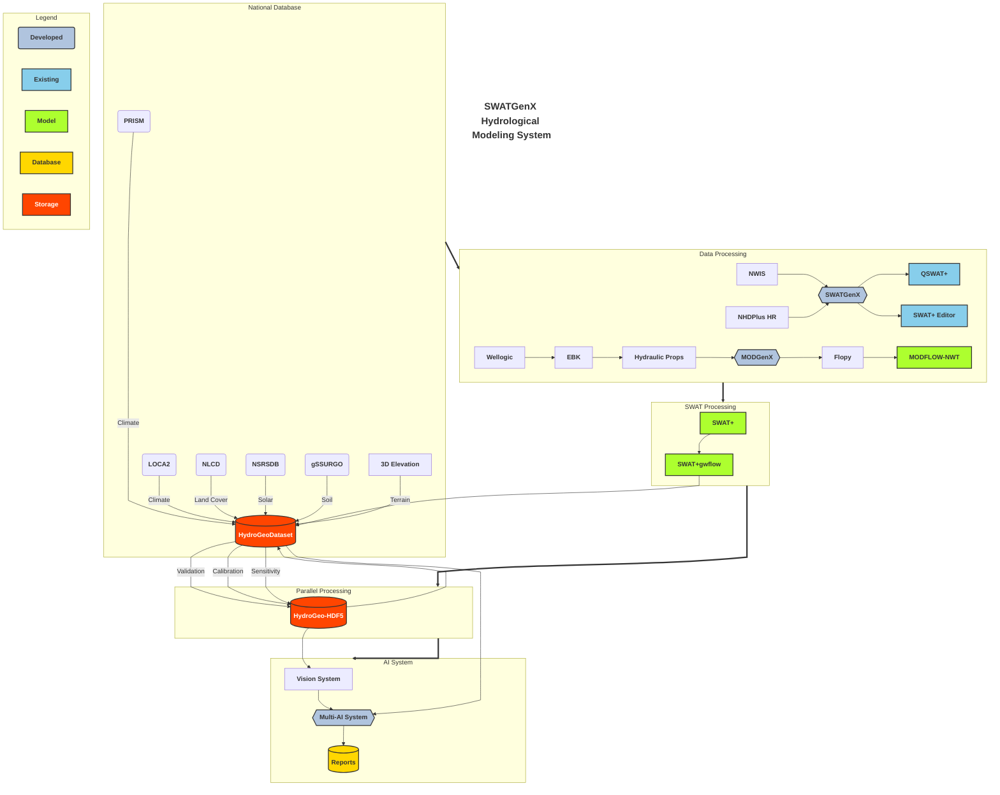

# HydroDeepNet

## Introduction

HydroDeepNet is an AI-powered online platform that integrates hydrological modeling, deep learning, and multi-agent AI systems to provide comprehensive hydrological insights at local, state, and national scales. It addresses one of the biggest challenges water resource managers face: creating well-calibrated models that can predict how land use and climate change impact water systems now and in the future.

This platform provides an easy-to-use, all-in-one tool that allows users, even those without modeling experience, to develop, calibrate, and present water resource models.

## System Architecture

## Key Components

HydroDeepNet consists of four significant developments:

### 1. Automated Hydrological Model Generation

HydroDeepNet streamlines the generation, calibration, and validation of surface water (SWAT+) and groundwater (MODFLOW) models at high resolution with exceptional flexibility. Key features include:

- **National Coverage**: Enables rapid model creation for any location across the conterminous United States (CONUS)
- **High Resolution**: Leverages NHDPlus HR (1:24k resolution), providing 20 times greater detail than platforms like the National Agroecosystem Model (NAM) which uses NHDPlus V2 (1:100k resolution)
- **Improved Precision**: Results in more precise watershed delineation and hydrological modeling, significantly enhancing water balance estimation and contaminant fate predictions
- **Proven Performance**: Successfully tested with 700 models across the US using USGS Federally Prioritized Streamgage (FPS) data
  - 660 models created successfully
  - 40 models failed due to hydrographical complexities
  - 60 calibrated and validated models established for USGS watersheds across Michigan with high predictive accuracy

### 2. Deep Learning for Hydrological Prediction

HydroDeepNet includes advanced machine learning capabilities:

- **Hybrid CNN-Transformer Model**: A deep learning model with 130 million parameters to predict evapotranspiration and groundwater recharge in 4D (time and 3D space)
- **Published Research**: Results have been submitted to the Engineering Applications of Artificial Intelligence journal
- **Computational Efficiency**: Provides a faster alternative to traditional resource-intensive modeling (SWAT+ and MODFLOW) with comparable accuracy
- **Enhanced Capabilities**: Improves data accuracy in missing-value scenarios and supports decision-making for drought monitoring, flood forecasting, and groundwater management

### 3. Automated Environmental and Agricultural Reporting System

The platform automates comprehensive environmental reporting:

- **Data Integration**: Compiles and structures large datasets for environmental indicator analysis
- **Comprehensive Metrics**: Generates reports on climate conditions, crop composition, solar energy balance, climate change projections, soil properties, and groundwater hydraulic conditions
- **Structured Output**: Produces reports in a structured format with markdown-based evaluations for rapid assessments
- **Geographic Coverage**: Currently operational for Michigan with planned expansion to CONUS

### 4. Multi-AI Agent System for Hydrological Insights

An intelligent analysis layer interprets model results:

- **Evidence-Based Insights**: Provides users with evidence-based agricultural and environmental insights
- **Model Integration**: Reads reports and model outputs to generate actionable information
- **Development Status**: Currently in limited implementation with full operational capability planned for the web application launch

## Technology Stack

HydroDeepNet incorporates elements from various open-source software and libraries:

- **Hydrological Modeling**:
  - QGIS, QSWAT+, and SWATPlusEditor for creating SWAT+ models ([QSWAT+ GitHub](https://github.com/swat-model/QSWATPlus))
  - Flopy library for creating MODFLOW models

- **Data Processing**:
  - GDAL library for analyses and processing of geospatial data

- **Artificial Intelligence**:
  - PyTorch library for creating and training hydrological deep learning models
  - Ollama library for the Multi-AI agents of the platform

- **Application Infrastructure**:
  - React for serving frontend
  - Docker and Kubernetes for deploying the platform

## Advantages Over Traditional Methods

HydroDeepNet offers significant improvements over traditional hydrological modeling approaches:

- **Time Efficiency**: Drastically reduces the traditionally time-consuming process of model creation
- **Accessibility**: Requires minimal technical expertise compared to conventional modeling
- **Resolution**: Provides 20x higher resolution than comparable national-scale models
- **Integration**: Seamlessly combines surface and groundwater modeling with AI-driven insights
- **Automation**: Automates reporting and analysis processes that typically require expert interpretation