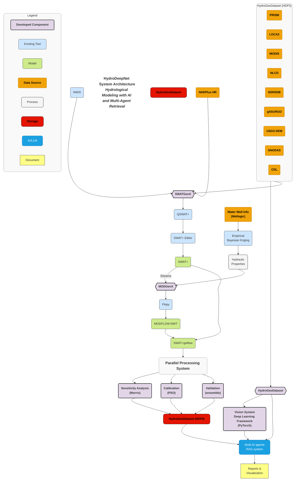

```mermaid
%%{init: {'theme': 'default', 'flowchart': {'curve': 'natural', 'diagramPadding': 20}, 'themeVariables': {'fontSize': '16px', 'fontFamily': 'arial'}}}%%
graph TB
    title["<b>HydroDeepNet System Architecture</b><br><i>Hydrological Modeling with AI and Multi-Agent Retrieval</i>"]:::title

    %% Main data storage components
    hydroGeoDatasetCyl["HydroGeoDataset"]:::storage
    hydroGeoHDFCyl["HydroGeoDataset (HDF5)"]:::storage
    
    %% Data Sources group
    subgraph DataSources["HydroGeoDataset (HDF5)"]
        direction LR
        PRISM("PRISM"):::datasource
        LOCA2("LOCA2"):::datasource
        MODIS("MODIS"):::datasource
        NLCD("NLCD"):::datasource
        NSRSDB("NSRSDB"):::datasource
        gSSURGO("gSSURGO"):::datasource
        USGSDEM("USGS DEM"):::datasource
        SNODAS("SNODAS"):::datasource
        CDL("CDL"):::datasource
    end

    %% Hydrological Modeling components
    NWIS("NWIS"):::existing
    NHDPlusHR("NHDPlus HR"):::datasource
    SWATGenX{{SWATGenX}}:::developed
    QSWATPlus("QSWAT+"):::existing
    SWATPlusEditor("SWAT+ Editor"):::existing
    SWATPlus("SWAT+"):::models
    SWATPlusGwflow("SWAT+gwflow"):::models

    %% Groundwater Modeling components
    WellInfo("Water Well Info<br>(Wellogic)"):::datasource
    EBK("Empirical<br>Bayesian Kriging"):::existing
    HydraulicProps("Hydraulic<br>Properties"):::process
    MODGenX{{MODGenX}}:::developed
    Flopy("Flopy"):::existing
    MODFLOWNWT("MODFLOW-NWT"):::models

    %% Parallel Processing System
    PPS["Parallel Processing System"]:::title
    Validation("Validation<br>(ensemble)"):::developed
    Calibration("Calibration<br>(PSO)"):::developed
    Sensitivity("Sensitivity Analysis<br>(Morris)"):::developed

    %% AI and Reporting
    VisionSystem("Vision System<br>Deep Learning Framework<br>(PyTorch)"):::developed
    MultiAI["Multi-AI agents<br>RAG system"]:::llm
    Reports["Reports &<br>Visualization"]:::document
    HydroGeoProcessor{{HydroGeoDataset}}:::developed

    %% Connections between components
    %% Data source to processor
    DataSources --> HydroGeoProcessor
    DataSources --> SWATGenX

    %% Hydrological modeling connections
    NWIS --> SWATGenX
    NHDPlusHR --> SWATGenX
    SWATGenX --> QSWATPlus
    QSWATPlus --> SWATPlusEditor
    SWATPlusEditor --> SWATPlus
    SWATPlus -->|Streams| MODGenX
    SWATPlus --> SWATPlusGwflow

    %% Groundwater modeling connections
    WellInfo --> EBK
    EBK --> HydraulicProps
    HydraulicProps --> MODGenX
    MODGenX --> Flopy
    Flopy --> MODFLOWNWT
    
    %% Parallel Processing connections
    SWATPlusGwflow --> PPS
    MODFLOWNWT --> SWATPlusGwflow
    PPS --> Sensitivity
    PPS --> Calibration 
    PPS --> Validation
    Sensitivity --> hydroGeoHDFCyl
    Calibration --> hydroGeoHDFCyl
    Validation --> hydroGeoHDFCyl

    %% AI and storage connections
    HydroGeoProcessor --> VisionSystem
    VisionSystem --> MultiAI
    hydroGeoHDFCyl --> MultiAI
    HydroGeoProcessor --> MultiAI
    MultiAI --> Reports
    
    %% Legend
    subgraph Legend["Legend"]
        direction LR
        dev["Developed Component"]:::developed
        ex["Existing Tool"]:::existing
        mod["Model"]:::models
        ds["Data Source"]:::datasource
        proc["Process"]:::process
        stor["Storage"]:::storage
        ai["AI/LLM"]:::llm
        doc["Document"]:::document
    end

    %% Enhanced styling with colors from the original diagram
    classDef title font-size:20px,fill:none,stroke:none,font-weight:bold,text-align:center
    classDef developed fill:#e1d5e7,stroke:#000000,stroke-width:2px,rx:5,ry:5,font-weight:bold
    classDef existing fill:#cce5ff,stroke:#36393d,stroke-width:1px,rx:5,ry:5
    classDef models fill:#cdeb8b,stroke:#36393d,stroke-width:1px,rx:5,ry:5
    classDef datasource fill:#f0a30a,stroke:#BD7000,stroke-width:1px,rx:4,ry:4,color:#000000,font-weight:bold
    classDef process fill:#f5f5f5,stroke:#000000,stroke-width:1px,rx:6,ry:6
    classDef storage fill:#e51400,stroke:#000000,stroke-width:1px,rx:10,ry:10,color:#000000,font-weight:bold
    classDef llm fill:#1ba1e2,stroke:#006EAF,stroke-width:1px,rx:8,ry:8,color:white
    classDef document fill:#ffff88,stroke:#36393d,stroke-width:1px
    
    %% Subgraph styling
    classDef subgraphStyle fill:#f9f9f9,stroke:#999,stroke-width:1px,rx:10,ry:10,color:#333
    class DataSources,Legend,PPS subgraphStyle
```