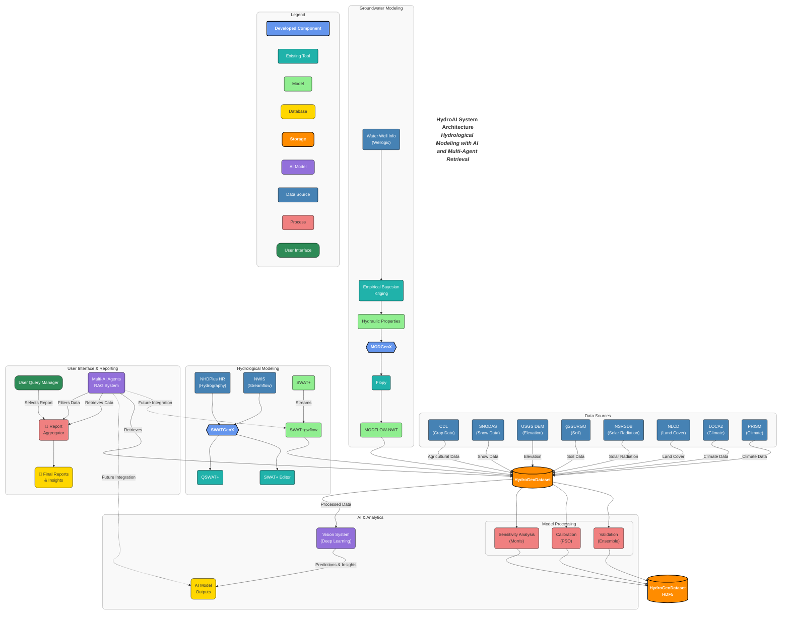

```mermaid
%%{init: {'theme': 'default', 'flowchart': {'curve': 'natural', 'diagramPadding': 20}, 'themeVariables': {'fontSize': '16px', 'fontFamily': 'arial'}}}%%
graph TB
    title["<b>HydroAI System Architecture</b><br><i>Hydrological Modeling with AI and Multi-Agent Retrieval</i>"]:::title

    %% Main subgraphs for logical organization
    subgraph DataSources["Data Sources"]
        direction LR
        PRISM("PRISM<br>(Climate)"):::datasource
        LOCA2("LOCA2<br>(Climate)"):::datasource
        NLCD("NLCD<br>(Land Cover)"):::datasource
        NSRSDB("NSRSDB<br>(Solar Radiation)"):::datasource
        gSSURGO("gSSURGO<br>(Soil)"):::datasource
        USGSDEM("USGS DEM<br>(Elevation)"):::datasource
        SNODAS("SNODAS<br>(Snow Data)"):::datasource
        CDL("CDL<br>(Crop Data)"):::datasource
    end

    subgraph HydroModels["Hydrological Modeling"]
        direction TB
        NWIS("NWIS<br>(Streamflow)"):::datasource
        NHDPlusHR("NHDPlus HR<br>(Hydrography)"):::datasource
        SWATGenX{{SWATGenX}}:::developed
        QSWATPlus("QSWAT+"):::existing
        SWATPlusEditor("SWAT+ Editor"):::existing
        SWATPlus("SWAT+"):::models
        SWATPlusGwflow("SWAT+gwflow"):::models
    end

    subgraph GWModels["Groundwater Modeling"]
        direction TB
        WellInfo("Water Well Info<br>(Wellogic)"):::datasource
        EBK("Empirical Bayesian<br>Kriging"):::existing
        HydraulicProps("Hydraulic Properties"):::models
        MODGenX{{MODGenX}}:::developed
        Flopy("Flopy"):::existing
        MODFLOWNWT("MODFLOW-NWT"):::models
    end
    
    subgraph AI["AI & Analytics"]
        direction TB
        VisionSystem("Vision System<br>(Deep Learning)"):::llm
        AI_Output("AI Model<br>Outputs"):::database
        
        subgraph ModelProcessing["Model Processing"]
            direction LR
            Validation("Validation<br>(Ensemble)"):::process
            Calibration("Calibration<br>(PSO)"):::process
            Sensitivity("Sensitivity Analysis<br>(Morris)"):::process
        end
    end
    
    subgraph UserInterface["User Interface & Reporting"]
        direction TB
        UserQuery("User Query Manager"):::user
        MultiAI("Multi-AI Agents<br>RAG System"):::llm
        ReportAggregator("📝 Report<br>Aggregator"):::process
        Reports("📄 Final Reports<br>& Insights"):::database
    end
    
    %% Central data storage
    HydroGeoDataset[("HydroGeoDataset")]:::storage
    HydroGeoDataset_HDF5[("HydroGeoDataset<br>HDF5")]:::storage
    
    %% Connections between components
    %% Data source connections
    PRISM -->|Climate Data| HydroGeoDataset
    LOCA2 -->|Climate Data| HydroGeoDataset
    NLCD -->|Land Cover| HydroGeoDataset
    NSRSDB -->|Solar Radiation| HydroGeoDataset
    gSSURGO -->|Soil Data| HydroGeoDataset
    USGSDEM -->|Elevation| HydroGeoDataset
    SNODAS -->|Snow Data| HydroGeoDataset
    CDL -->|Agricultural Data| HydroGeoDataset

    %% Hydrological modeling connections
    NWIS --> SWATGenX
    NHDPlusHR --> SWATGenX
    SWATGenX --> QSWATPlus
    SWATGenX --> SWATPlusEditor
    SWATPlus -->|Streams| SWATPlusGwflow
    SWATPlusGwflow --> HydroGeoDataset

    %% Groundwater modeling connections
    WellInfo --> EBK
    EBK --> HydraulicProps
    HydraulicProps --> MODGenX
    MODGenX --> Flopy
    Flopy --> MODFLOWNWT
    MODFLOWNWT --> HydroGeoDataset

    %% AI & Analytics connections
    HydroGeoDataset -->|Processed Data| VisionSystem
    VisionSystem -->|Predictions & Insights| AI_Output
    
    %% Processing connections
    HydroGeoDataset --> Validation
    HydroGeoDataset --> Calibration
    HydroGeoDataset --> Sensitivity
    Validation --> HydroGeoDataset_HDF5
    Calibration --> HydroGeoDataset_HDF5
    Sensitivity --> HydroGeoDataset_HDF5

    %% User interface connections
    MultiAI -->|Retrieves Data| ReportAggregator
    ReportAggregator --> Reports
    MultiAI -->|Retrieves| HydroGeoDataset
    MultiAI -->|Filters Data| ReportAggregator
    UserQuery -->|Selects Report| ReportAggregator

    %% Future connections
    MultiAI -.->|Future Integration| AI_Output
    MultiAI -.->|Future Integration| SWATPlusGwflow

    %% Legend
    subgraph Legend["Legend"]
        direction LR
        dev["Developed Component"]:::developed
        ex["Existing Tool"]:::existing
        mod["Model"]:::models
        db["Database"]:::database
        sto["Storage"]:::storage
        llm["AI Model"]:::llm
        ds["Data Source"]:::datasource
        proc["Process"]:::process
        usr["User Interface"]:::user
    end

    %% Enhanced styling with better colors
    classDef title font-size:20px,fill:none,stroke:none,font-weight:bold,text-align:center
    classDef developed fill:#6495ED,stroke:#000,stroke-width:2px,rx:5,ry:5,color:white,font-weight:bold
    classDef existing fill:#20B2AA,stroke:#000,stroke-width:1px,rx:5,ry:5,color:white
    classDef models fill:#90EE90,stroke:#000,stroke-width:1px,rx:5,ry:5
    classDef database fill:#FFD700,stroke:#000,stroke-width:1px,rx:10,ry:10
    classDef storage fill:#FF8C00,stroke:#000,stroke-width:2px,rx:10,ry:10,color:white,font-weight:bold
    classDef llm fill:#9370DB,stroke:#000,stroke-width:1px,rx:8,ry:8,color:white
    classDef datasource fill:#4682B4,stroke:#000,stroke-width:1px,rx:4,ry:4,color:white
    classDef process fill:#F08080,stroke:#000,stroke-width:1px,rx:6,ry:6
    classDef user fill:#2E8B57,stroke:#000,stroke-width:1px,rx:15,ry:15,color:white

    %% Subgraph styling
    classDef subgraphStyle fill:#f9f9f9,stroke:#999,stroke-width:1px,rx:10,ry:10,color:#333
    class DataSources,HydroModels,GWModels,AI,UserInterface,ModelProcessing,Legend subgraphStyle
```