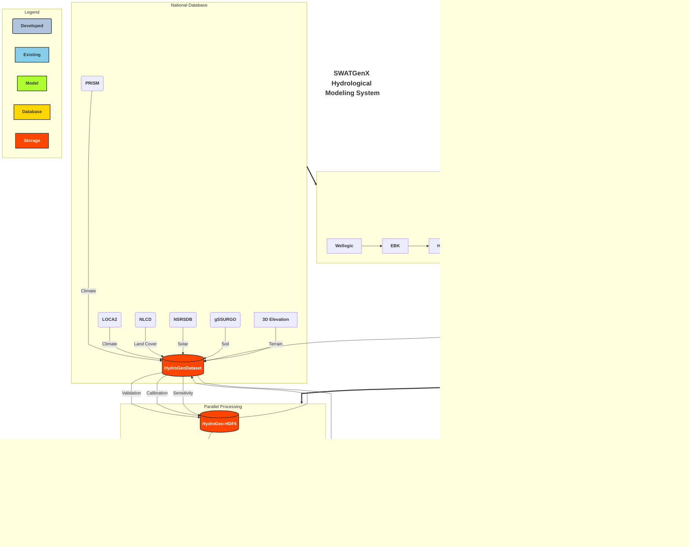

```mermaid
%%{init: {
  'theme': 'default',
  'flowchart': {'curve': 'monotoneX'},
  'themeVariables': {
    'fontSize': '16px',
    'fontFamily': 'arial',
    'lineWidth': '2px'
  }
}}%%
graph TB
    %% Main Title
    title[<b style='font-size:24px'>SWATGenX Hydrological Modeling System</b>]
    title:::title
    
    subgraph NatDB["National Database"]
        PRISM("PRISM") -->|Climate| HGD[(HydroGeoDataset)]
        LOCA2("LOCA2") -->|Climate| HGD
        NLCD("NLCD") -->|Land Cover| HGD
        NSRSDB("NSRSDB") -->|Solar| HGD
        gSSURGO("gSSURGO") -->|Soil| HGD
        Elev["3D Elevation"] -->|Terrain| HGD
    end

    subgraph DataProc["Data Processing"]
        NWIS --> SWGX{{SWATGenX}}
        NHD["NHDPlus HR"] --> SWGX
        SWGX --> QSWAT["QSWAT+"]:::existing
        SWGX --> SWATPlusEd["SWAT+ Editor"]:::existing
        
        WellInfo["Wellogic"] --> EBK["EBK"]
        EBK --> HProps["Hydraulic Props"]
        HProps --> MODGX{{MODGenX}}
        MODGX --> Flopy
        Flopy --> MODNWT["MODFLOW-NWT"]:::models
    end

    subgraph SWATProc["SWAT Processing"]
        SWATPlus["SWAT+"]:::models --> SWATGwflow["SWAT+gwflow"]:::models
        SWATGwflow --> HGD
    end

    subgraph ParProc["Parallel Processing"]
        HGD -- "Validation" --> HGDHDF[("HydroGeo-HDF5")]:::storage
        HGD -- "Calibration" --> HGDHDF
        HGD -- "Sensitivity" --> HGDHDF
    end

    subgraph AISystem["AI System"]
        HGDHDF --> Vision["Vision System"]
        HGDHDF --> HGD
        Vision --> MultiAI{{Multi-AI System}}:::developed
        HGD --> MultiAI
        MultiAI --> Reports[("Reports")]:::database
    end

    %% Main flow connections with distinct styles
    NatDB ==> DataProc
    DataProc ==> SWATProc
    SWATProc ==> ParProc
    ParProc ==> AISystem

    %% Legend in compact format
    subgraph Legend["Legend"]
        direction LR
        dev["Developed"]:::developed
        ex["Existing"]:::existing
        mod["Model"]:::models
        db["Database"]:::database
        sto["Storage"]:::storage
    end

    %% Improved styling
    classDef default font-size:16px,font-weight:bold
    classDef developed fill:#B0C4DE,stroke:#333,stroke-width:2px,rx:5,ry:5
    classDef existing fill:#87CEEB,stroke:#333,stroke-width:2px
    classDef models fill:#ADFF2F,stroke:#333,stroke-width:2px
    classDef database fill:#FFD700,stroke:#333,stroke-width:2px
    classDef storage fill:#FF4500,stroke:#333,stroke-width:2px,color:white
    classDef title fill:none,stroke:none
    
    %% Node class assignments
    SWGX:::developed
    MODGX:::developed
    HGDHDF:::storage
    HGD:::storage
```