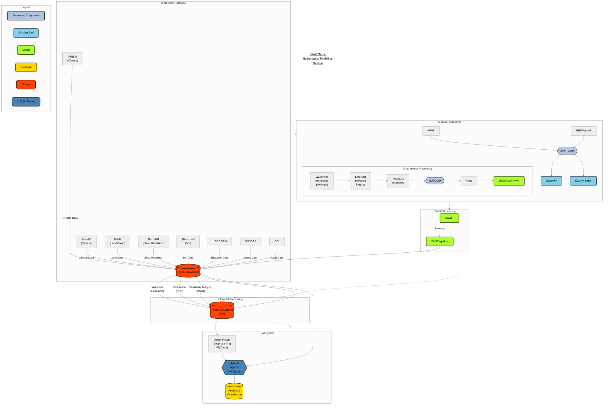

```mermaid
%%{init: {'theme': 'neutral', 'flowchart': {'curve': 'basis'}}}%%
graph TB
    %% Title and overall styling
    title[<u>SWATGenX Hydrological Modeling System</u>]
    title:::title

    subgraph National_Database["🌐 National Database"]
        direction LR
        PRISM["PRISM<br>(Climate)"] -->|Climate Data| HydroGeoDataset[(HydroGeoDataset)]
        LOCA2["LOCA2<br>(Climate)"] -->|Climate Data| HydroGeoDataset
        NLCD["NLCD<br>(Land Cover)"] -->|Land Cover| HydroGeoDataset
        NSRSDB["NSRSDB<br>(Solar Radiation)"] -->|Solar Radiation| HydroGeoDataset
        gSSURGO["gSSURGO<br>(Soil)"] -->|Soil Data| HydroGeoDataset
        USGSDEM["USGS DEM"] -->|Elevation Data| HydroGeoDataset
        SNODAS["SNODAS"] -->|Snow Data| HydroGeoDataset
        CDL["CDL"] -->|Crop Data| HydroGeoDataset
    end

    subgraph Data_Processing["⚙️ Data Processing"]
        direction TB
        NWIS["NWIS"] --> SWATGenX{{SWATGenX}}
        NHDPlusHR["NHDPlus HR"] --> SWATGenX
        SWATGenX --> QSWATPlus["QSWAT+"]
        SWATGenX --> SWATPlusEditor["SWAT+ Editor"]

        subgraph Groundwater_Processing["Groundwater Processing"]
            direction LR
            WellInfo["Water well<br>information<br>(Wellogic)"] --> EBK["Empirical<br>Bayesian<br>Kriging"]
            EBK --> HydraulicProps["Hydraulic<br>properties"]
            HydraulicProps --> MODGenX{{MODGenX}}
            MODGenX --> Flopy["Flopy"]
            Flopy --> MODFLOWNWT["MODFLOW-NWT"]
        end
    end

    subgraph SWAT_Processing["🌊 SWAT Processing"]
        SWATPlus["SWAT+"] -->|Streams| SWATPlusGwflow["SWAT+gwflow"]
        SWATPlusGwflow --> HydroGeoDataset
    end

    subgraph Parallel_Processing["⚡ Parallel Processing"]
        direction TB
        HydroGeoDataset -- "Validation<br>(Ensemble)" --> HydroGeoDataset_HDF5[("HydroGeoDataset<br>HDF5")]
        HydroGeoDataset -- "Calibration<br>(PSO)" --> HydroGeoDataset_HDF5
        HydroGeoDataset -- "Sensitivity Analysis<br>(Morris)" --> HydroGeoDataset_HDF5
    end

    subgraph AI_System["🧠 AI System"]
        direction TB
        HydroGeoDataset_HDF5 --> VisionSystem["Vision System<br>Deep Learning<br>(PyTorch)"]
        HydroGeoDataset_HDF5 --> HydroGeoDataset
        VisionSystem --> MultiAI{{Multi-AI<br>Agents<br>RAG System}}
        HydroGeoDataset --> MultiAI
        MultiAI --> Reports[("Reports &<br>Visualization")]
    end

    %% Connections between subgraphs
    National_Database -.-> Data_Processing
    Data_Processing -.-> SWAT_Processing
    SWAT_Processing -.-> Parallel_Processing
    Parallel_Processing -.-> AI_System

    %% Legend
    subgraph Legend["Legend"]
        direction LR
        dev["Developed Component"]:::developed
        ex["Existing Tool"]:::existing
        mod["Model"]:::models
        db["Database"]:::database
        sto["Storage"]:::storage
        llm["LLM (AI Model)"]:::llm
    end

    %% Class Definitions with enhanced styling
    classDef developed fill:#B0C4DE,stroke:#000,stroke-width:2px,rx:5,ry:5
    classDef existing fill:#87CEEB,stroke:#000,stroke-width:2px,rx:5,ry:5
    classDef models fill:#ADFF2F,stroke:#000,stroke-width:2px,rx:5,ry:5
    classDef database fill:#FFD700,stroke:#000,stroke-width:2px,rx:10,ry:10
    classDef storage fill:#FF4500,stroke:#000,stroke-width:2px,rx:10,ry:10
    classDef llm fill:#4682B4,stroke:#000,stroke-width:2px,rx:10,ry:10
    classDef title font-size:18px,fill:none,stroke:none

    %% Apply classes to nodes
    HydroGeoDataset_HDF5:::storage
    HydroGeoDataset:::storage
    SWATPlusGwflow:::models
    SWATPlus:::models
    MODFLOWNWT:::models
    QSWATPlus:::existing
    SWATPlusEditor:::existing
    SWATGenX:::developed
    MODGenX:::developed
    MultiAI:::llm
    Reports:::database
```