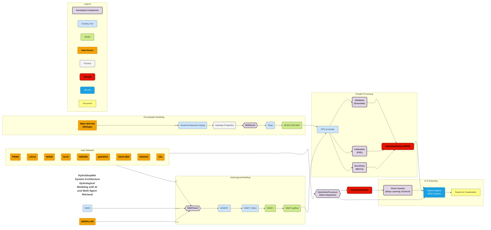

```mermaid
%%{init: {'theme': 'default', 'flowchart': {'curve': 'natural', 'diagramPadding': 20}, 'themeVariables': {'fontSize': '16px', 'fontFamily': 'arial'}}}%%
graph LR
    title["<b>HydroDeepNet System Architecture</b><br><i>Hydrological Modeling with AI and Multi-Agent Retrieval</i>"]:::title

    %% 1. INPUT DATASETS
    subgraph Input_Datasets["Input Datasets"]
    direction TB
        PRISM("PRISM"):::datasource
        LOCA2("LOCA2"):::datasource
        MODIS("MODIS"):::datasource
        NLCD("NLCD"):::datasource
        NSRSDB("NSRSDB"):::datasource
        gSSURGO("gSSURGO"):::datasource
        USGSDEM("USGS DEM"):::datasource
        SNODAS("SNODAS"):::datasource
        CDL("CDL"):::datasource
    end

    %% 2. DATA INTEGRATION
    HydroGeoProcessor{{"HydroGeoProcessor<br>(Data Integration)"}}:::developed
    hydroGeoDatasetCyl["HydroGeoDataset"]:::storage

    %% Additional Data Inputs
    NWIS("NWIS"):::existing
    NHDPlusHR("NHDPlus HR"):::datasource

    %% 3. HYDROLOGICAL MODELING
    subgraph Hydrological_Modeling["Hydrological Modeling"]
    direction TB
        SWATGenX{{SWATGenX}}:::developed
        QSWATPlus("QSWAT+"):::existing
        SWATPlusEditor("SWAT+ Editor"):::existing
        SWATPlus("SWAT+"):::models
        SWATPlusGwflow("SWAT+gwflow"):::models
    end

    %% GROUNDWATER MODELING
    subgraph Groundwater_Modeling["Groundwater Modeling"]
    direction TB
        WellInfo("Water Well Info<br>(Wellogic)"):::datasource
        EBK("Empirical Bayesian Kriging"):::existing
        HydraulicProps("Hydraulic Properties"):::process
        MODGenX{{MODGenX}}:::developed
        Flopy("Flopy"):::existing
        MODFLOWNWT("MODFLOW-NWT"):::models
    end

    %% 4. PARALLEL PROCESSING
    subgraph Parallel_Processing["Parallel Processing"]
    direction TB
        PPS["PPS Controller"]:::existing
        Validation("Validation<br>(Ensemble)"):::developed
        Calibration("Calibration<br>(PSO)"):::developed
        Sensitivity("Sensitivity<br>(Morris)"):::developed
        hydroGeoHDFCyl["HydroGeoDataset (HDF5)"]:::storage
    end

    %% 5. AI & REPORTING
    subgraph AI_Reporting["AI & Reporting"]
    direction TB
        VisionSystem("Vision System<br>(Deep Learning, PyTorch)"):::developed
        MultiAI["Multi-AI Agents<br>(RAG System)"]:::llm
        Reports["Reports & Visualization"]:::document
    end

    %% ---- EDGES / CONNECTIONS ----

    %% (A) Input to Data Processor
    Input_Datasets --> HydroGeoProcessor
    HydroGeoProcessor --> hydroGeoDatasetCyl

    %% (B) Data to SWATGenX
    Input_Datasets --> SWATGenX
    NWIS --> SWATGenX
    NHDPlusHR --> SWATGenX

    %% (C) Hydrological Modeling Flow
    SWATGenX --> QSWATPlus
    QSWATPlus --> SWATPlusEditor
    SWATPlusEditor --> SWATPlus
    SWATPlus --> SWATPlusGwflow

    %% (D) Groundwater Modeling Flow
    WellInfo --> EBK
    EBK --> HydraulicProps
    HydraulicProps --> MODGenX
    MODGenX --> Flopy
    Flopy --> MODFLOWNWT

    %% (E) Parallel Processing Flow
    SWATPlusGwflow --> PPS
    MODFLOWNWT --> PPS
    PPS --> Validation
    PPS --> Calibration
    PPS --> Sensitivity
    Validation --> hydroGeoHDFCyl
    Calibration --> hydroGeoHDFCyl
    Sensitivity --> hydroGeoHDFCyl

    %% (F) AI & Reporting Flow
    hydroGeoDatasetCyl --> VisionSystem
    VisionSystem --> MultiAI
    hydroGeoHDFCyl --> MultiAI
    HydroGeoProcessor --> MultiAI
    MultiAI --> Reports

    %% LEGEND
    subgraph Legend["Legend"]
    direction LR
        dev["Developed Component"]:::developed
        ex["Existing Tool"]:::existing
        mod["Model"]:::models
        ds["Data Source"]:::datasource
        proc["Process"]:::process
        stor["Storage"]:::storage
        ai["AI/LLM"]:::llm
        doc["Document"]:::document
    end

    %% STYLING
    classDef title font-size:20px,fill:none,stroke:none,font-weight:bold,text-align:center
    classDef developed fill:#e1d5e7,stroke:#000000,stroke-width:2px,rx:5,ry:5,font-weight:bold
    classDef existing fill:#cce5ff,stroke:#36393d,stroke-width:1px,rx:5,ry:5
    classDef models fill:#cdeb8b,stroke:#36393d,stroke-width:1px,rx:5,ry:5
    classDef datasource fill:#f0a30a,stroke:#BD7000,stroke-width:1px,rx:4,ry:4,color:#000000,font-weight:bold
    classDef process fill:#f5f5f5,stroke:#000000,stroke-width:1px,rx:6,ry:6
    classDef storage fill:#e51400,stroke:#000000,stroke-width:1px,rx:10,ry:10,color:#000000,font-weight:bold
    classDef llm fill:#1ba1e2,stroke:#006EAF,stroke-width:1px,rx:8,ry:8,color:white
    classDef document fill:#ffff88,stroke:#36393d,stroke-width:1px
```