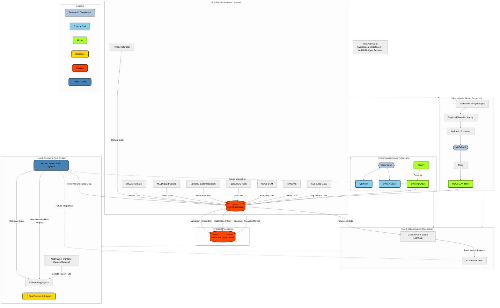

```mermaid
%%{init: {'theme': 'neutral', 'flowchart': {'curve': 'basis'}}}%%
graph TB
    title["HydroAI System: Hydrological Modeling, AI, and Multi-Agent Retrieval"]

    %% Data Sources
    subgraph National_Database["🌐 National & External Datasets"]
        PRISM["PRISM (Climate)"] -->|Climate Data| HydroGeoDataset[(HydroGeoDataset)]
        LOCA2["LOCA2 (Climate)"] -->|Climate Data| HydroGeoDataset
        NLCD["NLCD (Land Cover)"] -->|Land Cover| HydroGeoDataset
        NSRSDB["NSRSDB (Solar Radiation)"] -->|Solar Radiation| HydroGeoDataset
        gSSURGO["gSSURGO (Soil)"] -->|Soil Data| HydroGeoDataset
        USGSDEM["USGS DEM"] -->|Elevation Data| HydroGeoDataset
        SNODAS["SNODAS"] -->|Snow Data| HydroGeoDataset
        CDL["CDL (Crop Data)"] -->|Agricultural Data| HydroGeoDataset
    end

    %% Hydrological Model Processing
    subgraph Hydrological_Models["🌊 Hydrological Model Processing"]
        SWATGenX{{SWATGenX}} --> QSWATPlus["QSWAT+"]
        SWATGenX --> SWATPlusEditor["SWAT+ Editor"]
        SWATPlus["SWAT+"] -->|Streams| SWATPlusGwflow["SWAT+gwflow"]
        SWATPlusGwflow --> HydroGeoDataset
    end

    %% Groundwater Model Processing
    subgraph Groundwater_Processing["💧 Groundwater Model Processing"]
        WellInfo["Water Well Info (Wellogic)"] --> EBK["Empirical Bayesian Kriging"]
        EBK --> HydraulicProps["Hydraulic Properties"]
        HydraulicProps --> MODGenX{{MODGenX}}
        MODGenX --> Flopy["Flopy"]
        Flopy --> MODFLOWNWT["MODFLOW-NWT"]
        MODFLOWNWT --> HydroGeoDataset
    end

    %% AI & Vision System Processing
    subgraph AI_System["🧠 AI & Vision System Processing"]
        VisionSystem["Vision System (Deep Learning)"]
        HydroGeoDataset -->|Processed Data| VisionSystem
        VisionSystem -->|Predictions & Insights| AI_Output["AI Model Outputs"]
    end

    %% Parallel Processing and Report Generation
    subgraph Parallel_Processing["⚡ Parallel Processing"]
        HydroGeoDataset -- "Validation (Ensemble)" --> HydroGeoDataset_HDF5[("HydroGeoDataset HDF5")]
        HydroGeoDataset -- "Calibration (PSO)" --> HydroGeoDataset_HDF5
        HydroGeoDataset -- "Sensitivity Analysis (Morris)" --> HydroGeoDataset_HDF5
    end

    %% Multi-AI RAG System (User Interaction and Data Retrieval)
    subgraph MultiAI_RAG["🤖 Multi-AI Agents RAG System"]
        UserQuery["User Query Manager (Search/Request)"] 
        MultiAI["Multi-AI Agents RAG System"] -->|Retrieves Data| ReportAggregator["📝 Report Aggregator"]
        ReportAggregator --> Reports["📄 Final Reports & Insights"]
        
        MultiAI -->|Retrieves Structured Data| HydroGeoDataset
        MultiAI -->|Filters Data by User Request| ReportAggregator
        UserQuery -->|Selects Report Type| ReportAggregator

        %% Potential Future Connections
        MultiAI -.-|Future Integration| AI_Output
        MultiAI -.-|Future Integration| SWATPlusGwflow
    end

    %% Connections Between Components
    National_Database -.-> Hydrological_Models
    National_Database -.-> Groundwater_Processing
    Hydrological_Models -.-> AI_System
    Groundwater_Processing -.-> AI_System
    AI_System -.-> MultiAI_RAG
    Parallel_Processing -.-> MultiAI_RAG

    %% Legend
    subgraph Legend["Legend"]
        direction LR
        dev["Developed Component"]:::developed
        ex["Existing Tool"]:::existing
        mod["Model"]:::models
        db["Database"]:::database
        sto["Storage"]:::storage
        llm["LLM (AI Model)"]:::llm
    end

    %% Styling
    classDef developed fill:#B0C4DE,stroke:#000,stroke-width:2px,rx:5,ry:5
    classDef existing fill:#87CEEB,stroke:#000,stroke-width:2px,rx:5,ry:5
    classDef models fill:#ADFF2F,stroke:#000,stroke-width:2px,rx:5,ry:5
    classDef database fill:#FFD700,stroke:#000,stroke-width:2px,rx:10,ry:10
    classDef storage fill:#FF4500,stroke:#000,stroke-width:2px,rx:10,ry:10
    classDef llm fill:#4682B4,stroke:#000,stroke-width:2px,rx:10,ry:10
    classDef title font-size:18px,fill:none,stroke:none

    %% Assign Classes to Nodes
    HydroGeoDataset_HDF5:::storage
    HydroGeoDataset:::storage
    SWATPlusGwflow:::models
    SWATPlus:::models
    MODFLOWNWT:::models
    QSWATPlus:::existing
    SWATPlusEditor:::existing
    SWATGenX:::developed
    MODGenX:::developed
    MultiAI:::llm
    Reports:::database
```