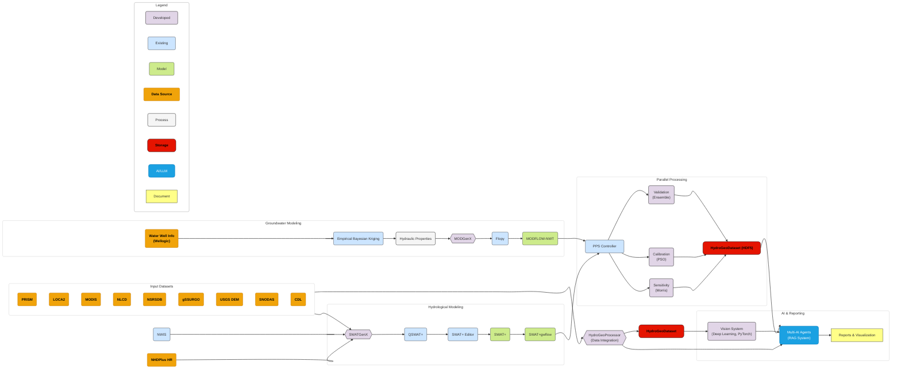

```mermaid
%%{init: {
  'theme': 'default',
  'flowchart': {
    'curve': 'natural',
    'diagramPadding': 10
  },
  'themeVariables': {
    'fontSize': '14px',
    'fontFamily': 'arial'
  }
}}%%
graph LR
linkStyle default stroke:#333,stroke-width:1.5px

%% ---------------------
%% 1. INPUT DATASETS
%% ---------------------
subgraph Input_Datasets["Input Datasets"]
direction TB
    PRISM("PRISM"):::datasource
    LOCA2("LOCA2"):::datasource
    MODIS("MODIS"):::datasource
    NLCD("NLCD"):::datasource
    NSRSDB("NSRSDB"):::datasource
    gSSURGO("gSSURGO"):::datasource
    USGSDEM("USGS DEM"):::datasource
    SNODAS("SNODAS"):::datasource
    CDL("CDL"):::datasource
end

%% Data Integration
HydroGeoProcessor{{"HydroGeoProcessor<br>(Data Integration)"}}:::developed
hydroGeoDatasetCyl["HydroGeoDataset"]:::storage

%% Additional Data Inputs
NWIS("NWIS"):::existing
NHDPlusHR("NHDPlus HR"):::datasource

%% ---------------------
%% 2. HYDROLOGICAL MODELING
%% ---------------------
subgraph Hydrological_Modeling["Hydrological Modeling"]
direction TB
    SWATGenX{{SWATGenX}}:::developed
    QSWATPlus("QSWAT+"):::existing
    SWATPlusEditor("SWAT+ Editor"):::existing
    SWATPlus("SWAT+"):::models
    SWATPlusGwflow("SWAT+gwflow"):::models
end

%% ---------------------
%% 3. GROUNDWATER MODELING
%% ---------------------
subgraph Groundwater_Modeling["Groundwater Modeling"]
direction TB
    WellInfo("Water Well Info<br>(Wellogic)"):::datasource
    EBK("Empirical Bayesian Kriging"):::existing
    HydraulicProps("Hydraulic Properties"):::process
    MODGenX{{MODGenX}}:::developed
    Flopy("Flopy"):::existing
    MODFLOWNWT("MODFLOW-NWT"):::models
end

%% ---------------------
%% 4. PARALLEL PROCESSING
%% ---------------------
subgraph Parallel_Processing["Parallel Processing"]
direction TB
    PPS["PPS Controller"]:::existing
    Validation("Validation<br>(Ensemble)"):::developed
    Calibration("Calibration<br>(PSO)"):::developed
    Sensitivity("Sensitivity<br>(Morris)"):::developed
    hydroGeoHDFCyl["HydroGeoDataset (HDF5)"]:::storage
end

%% ---------------------
%% 5. AI & REPORTING
%% ---------------------
subgraph AI_Reporting["AI & Reporting"]
direction TB
    VisionSystem("Vision System<br>(Deep Learning, PyTorch)"):::developed
    MultiAI["Multi-AI Agents<br>(RAG System)"]:::llm
    Reports["Reports & Visualization"]:::document
end

%% ---------------------
%% EDGES / CONNECTIONS
%% ---------------------
%% (A) Input -> Processor
Input_Datasets --> HydroGeoProcessor
HydroGeoProcessor --> hydroGeoDatasetCyl

%% (B) Additional Data -> SWATGenX
Input_Datasets --> SWATGenX
NWIS --> SWATGenX
NHDPlusHR --> SWATGenX

%% (C) Hydrological Modeling Flow
SWATGenX --> QSWATPlus
QSWATPlus --> SWATPlusEditor
SWATPlusEditor --> SWATPlus
SWATPlus --> SWATPlusGwflow

%% (D) Groundwater Modeling Flow
WellInfo --> EBK
EBK --> HydraulicProps
HydraulicProps --> MODGenX
MODGenX --> Flopy
Flopy --> MODFLOWNWT

%% (E) Parallel Processing Flow
SWATPlusGwflow --> PPS
MODFLOWNWT --> PPS
PPS --> Validation
PPS --> Calibration
PPS --> Sensitivity
Validation --> hydroGeoHDFCyl
Calibration --> hydroGeoHDFCyl
Sensitivity --> hydroGeoHDFCyl

%% (F) AI & Reporting Flow
hydroGeoDatasetCyl --> VisionSystem
VisionSystem --> MultiAI
hydroGeoHDFCyl --> MultiAI
HydroGeoProcessor --> MultiAI
MultiAI --> Reports

%% ---------------------
%% LEGEND (SMALLER BOX)
%% ---------------------
subgraph Legend["Legend"]
direction LR
DevComp["Developed"]:::developed
ExistTool["Existing"]:::existing
ModelNode["Model"]:::models
DataSrc["Data Source"]:::datasource
ProcNode["Process"]:::process
StorNode["Storage"]:::storage
AIComp["AI/LLM"]:::llm
DocNode["Document"]:::document
end

%% Minimal styling for subgraphs
style Input_Datasets fill:#fff,stroke:#ccc,stroke-width:1px,rx:5,ry:5
style Hydrological_Modeling fill:#fff,stroke:#ccc,stroke-width:1px,rx:5,ry:5
style Groundwater_Modeling fill:#fff,stroke:#ccc,stroke-width:1px,rx:5,ry:5
style Parallel_Processing fill:#fff,stroke:#ccc,stroke-width:1px,rx:5,ry:5
style AI_Reporting fill:#fff,stroke:#ccc,stroke-width:1px,rx:5,ry:5
style Legend fill:#fff,stroke:#999,stroke-width:1px,rx:5,ry:5

%% Title styling
classDef title font-size:18px,fill:none,stroke:none,font-weight:bold,text-align:center

%% Node class styling
classDef developed fill:#e1d5e7,stroke:#000000,stroke-width:1px,rx:5,ry:5
classDef existing fill:#cce5ff,stroke:#36393d,stroke-width:1px,rx:5,ry:5
classDef models fill:#cdeb8b,stroke:#36393d,stroke-width:1px,rx:5,ry:5
classDef datasource fill:#f0a30a,stroke:#BD7000,stroke-width:1px,rx:4,ry:4,color:#000000,font-weight:bold
classDef process fill:#f5f5f5,stroke:#000000,stroke-width:1px,rx:6,ry:6
classDef storage fill:#e51400,stroke:#000000,stroke-width:1px,rx:10,ry:10,color:#000000,font-weight:bold
classDef llm fill:#1ba1e2,stroke:#006EAF,stroke-width:1px,rx:8,ry:8,color:white
classDef document fill:#ffff88,stroke:#36393d,stroke-width:1px
```